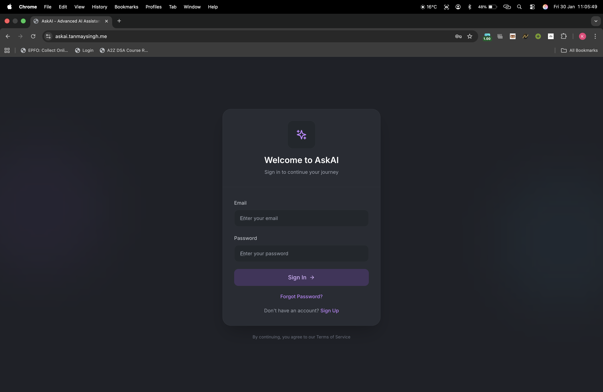
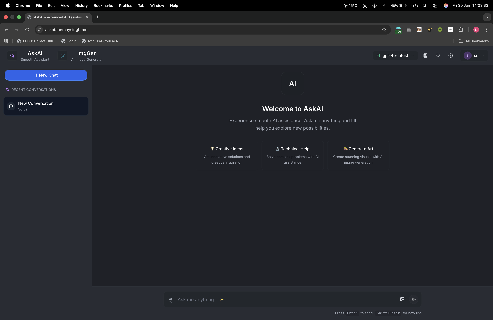
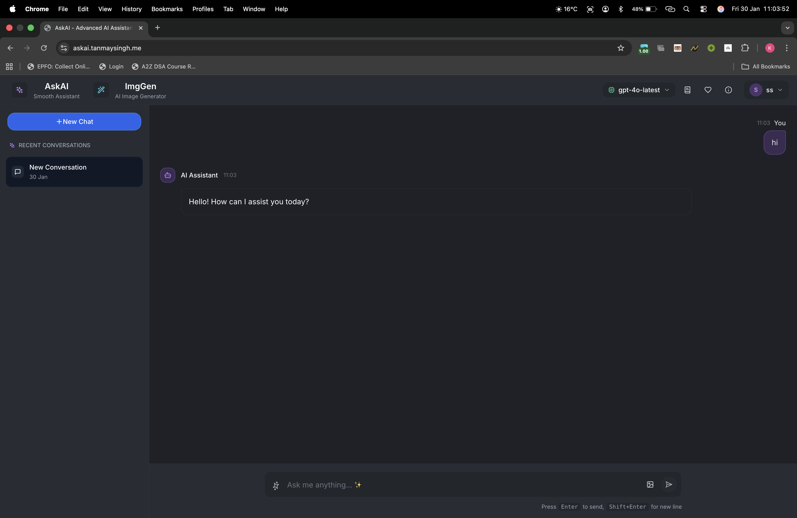
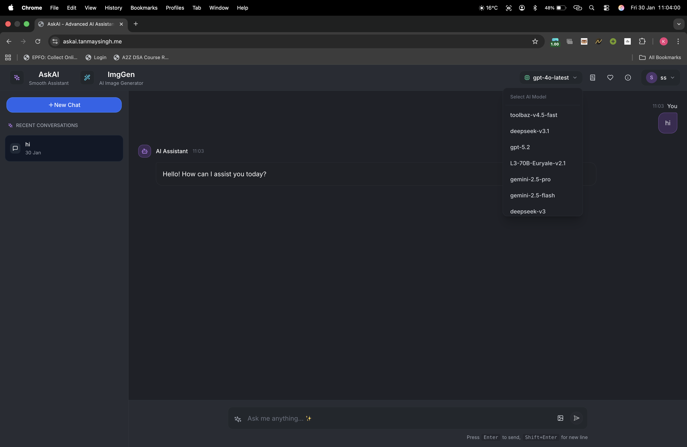
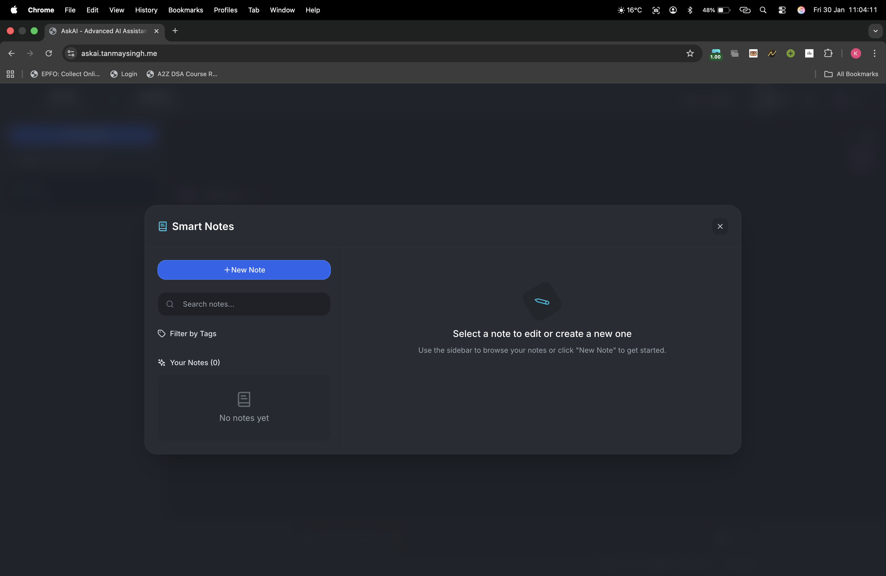
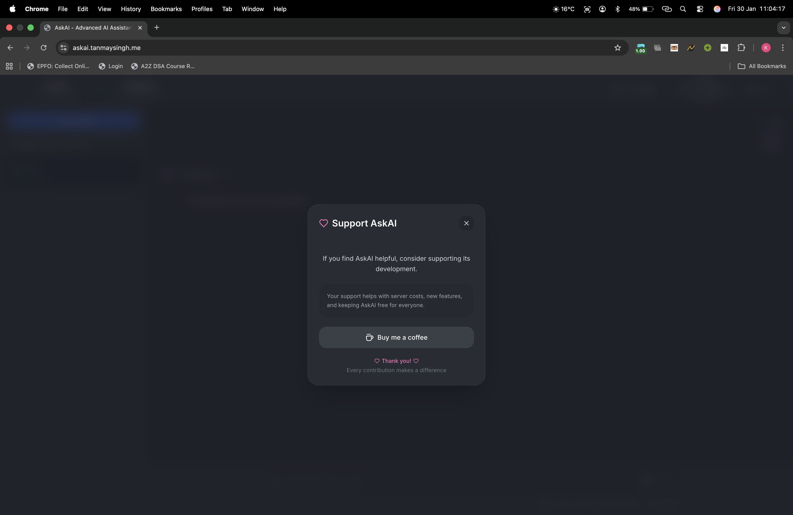
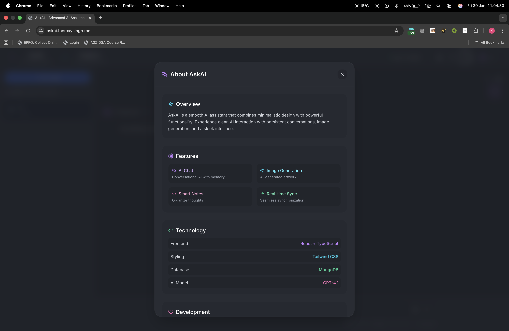
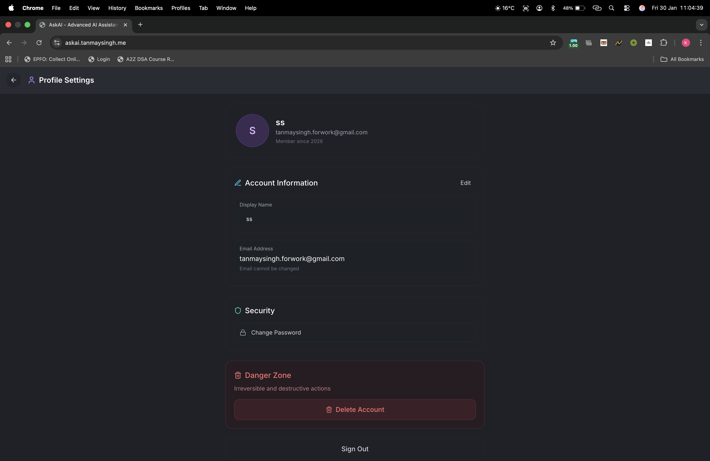
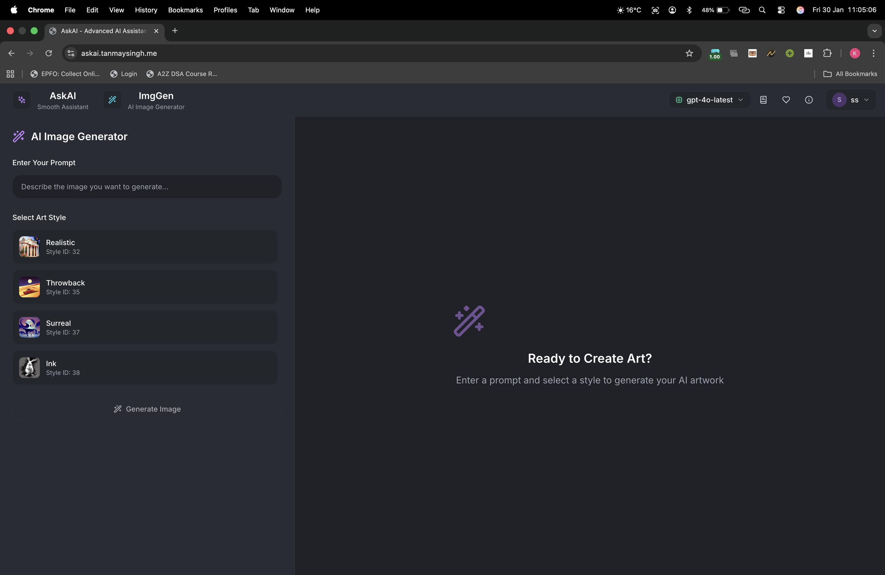
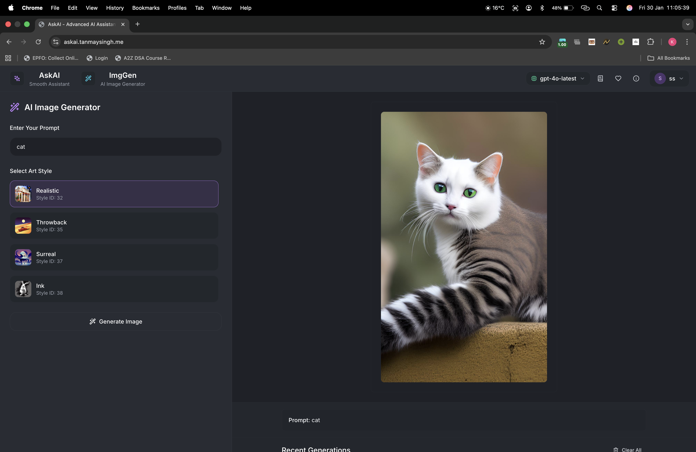

# AskAI - Your Intelligent Chat Companion 🤖 

**A modern, cross-platform AI chat application with web and mobile support**

🌐 **Live Demo:** [askai.tanmaysingh.me](https://askai.tanmaysingh.me)

---

## 🎯 Overview

AskAI is a modern, cross-platform AI assistant that combines beautiful design with powerful functionality. Built with React and React Native, it offers a seamless experience across web and mobile devices.

**Key Highlights:**
- 🤖 **Multiple AI Models** - Choose from GPT-4o, DeepSeek, Gemini, and more
- 🎨 **AI Image Generation** - Create stunning artwork with various art styles
- 📝 **Smart Notes** - Organize your thoughts with tags and search
- 💬 **Persistent Conversations** - Your chats are saved and synced
- 🌓 **Dark/Light Themes** - Beautiful UI that adapts to your preference

---

## 📸 Screenshots

### 🔐 Login

### 💬 Chat Interface

### 🤖 AI Response

### 🎯 AI Model Selector

### 📝 Smart Notes

### 💖 Support

### ℹ️ About

### ⚙️ Profile Settings

### 🎨 Image Generator

### 🖼️ Generated Image

---

## ✨ Key Features

### 🧠 AI Capabilities
- **Advanced AI Integration** - Powered by GPT-4.1 for intelligent responses
- **AI Model Selector** - Choose from multiple AI models dynamically
- **Image Generation** - Create stunning AI-generated artwork
- **Smart Notes** - Organize and manage your thoughts

### 💬 Chat Experience
- **Persistent Memory** - Your conversations are saved and accessible anytime
- **Real-time Interaction** - Instant responses with smooth animations
- **Conversation Management** - Organize and manage multiple chat threads
- **Typing Indicators** - Beautiful animated "✨ AI is thinking..." indicators

### 🎨 Design & UX
- **Dark/Light Themes** - Easy on your eyes, day or night
- **Responsive Design** - Perfect experience on any device
- **Smooth Animations** - Polished UI with Framer Motion (web) and Reanimated (mobile)
- **Modern UI** - Glassmorphism effects and gradient accents

### 📱 Cross-Platform
- **Web App** - React + Vite + TailwindCSS
- **Mobile App** - React Native + Expo (iOS & Android)
- **Shared Backend** - Node.js + Express + MongoDB

---

## 🛠️ Tech Stack

| Platform | Technologies |
|----------|-------------|
| **Web** | React 18, TypeScript, Tailwind CSS, Framer Motion, Vite |
| **Mobile** | React Native, Expo SDK 52, Reanimated 3, React Navigation |
| **Backend** | Node.js, Express, MongoDB, JWT |

---

## � What's New in v4.0.0

- ✨ **AI Model Selector** - Choose from multiple AI models
- 🔄 **Dynamic Model Fetching** - Models loaded from API
- 🎨 **Enhanced UI Animations** - Smoother transitions
- 📜 **Improved Chat Scroll** - Better scroll behavior
- 🚀 **Performance Improvements** - Faster and more stable
- 💬 **Relocated Thinking Indicator** - Now appears as chat message bubble

---

## 📞 Contact & Support

**⭐ Star this repo to show support!**

---

**Made with ❤️ by Tanmay Singh**

