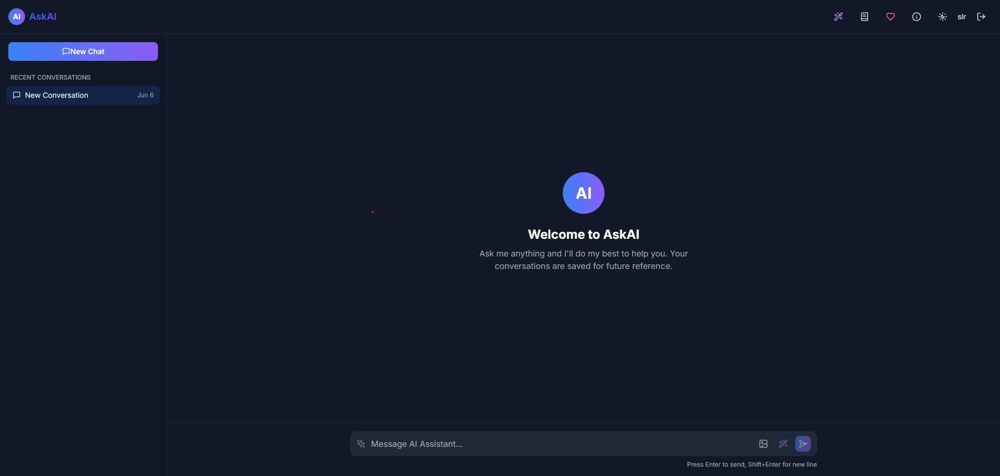

# AskAI - Your Intelligent Chat Companion 🤖 

## 🎯 Overview

AskAI transforms the way you interact with AI. Built with cutting-edge technology, it offers an intuitive chat experience with persistent history and real-time responses. Whether you're brainstorming ideas, seeking answers, or just having a conversation, AskAI is your intelligent companion.

## ✨ Key Features

- 🧠 **Advanced AI Integration** - Powered by GPT-4.1 for intelligent responses
- 💾 **Persistent Memory** - Your conversations are saved and accessible anytime
- 🌓 **Dark/Light Themes** - Easy on your eyes, day or night
- 📱 **Responsive Design** - Perfect experience on any device
- 📂 **Conversation Management** - Organize and manage multiple chat threads
- ⚡ **Real-time Interaction** - Instant responses with no delay

## 🛠️ Built With

- **Frontend Framework:** React with TypeScript
- **Styling:** Tailwind CSS
- **Build Tool:** Vite
- **AI Engine:** GPT-4.1

## 🖥️ Interface

### 🌞 Light Mode

### 🌙 Dark Mode

## 📊 Current Status

**Version:** 1.0.0 (Initial Release)
- All core features implemented
- Regular updates and improvements planned
- Community feedback welcome

## 🤝 Contributing

Your contributions make AskAI better! Feel free to:
- Report bugs
- Suggest features
- Submit pull requests

## 📝 License

This project is licensed under the MIT License - see the [LICENSE](LICENSE) file for details.

## 📞 Contact & Support

- 📧 GitHub: [@Tanmaysingh](https://github.com/Tanmaysingh3856)
- 🌟 Star this repo to show support!

---
